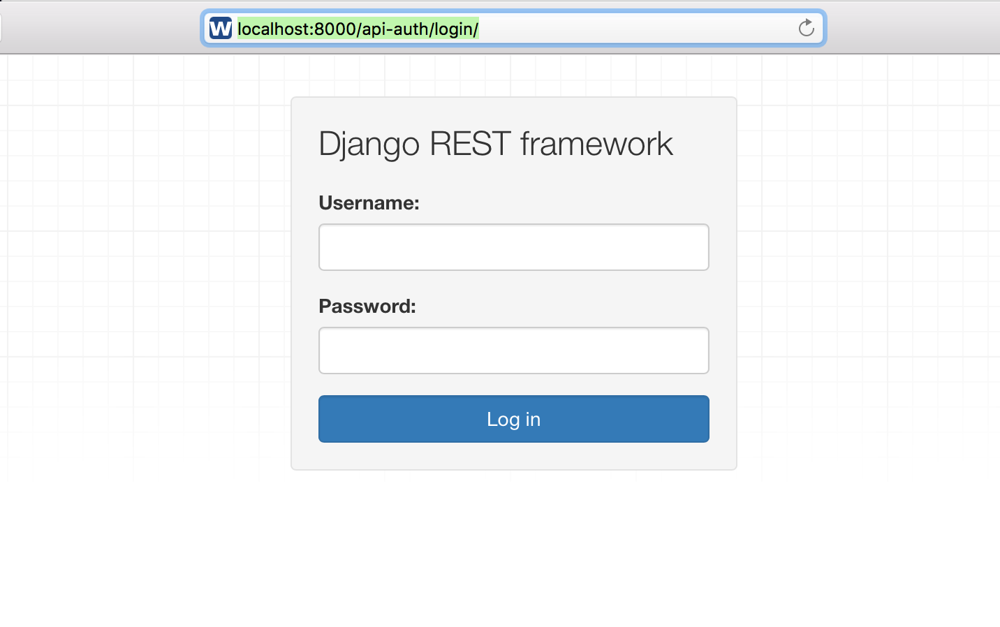
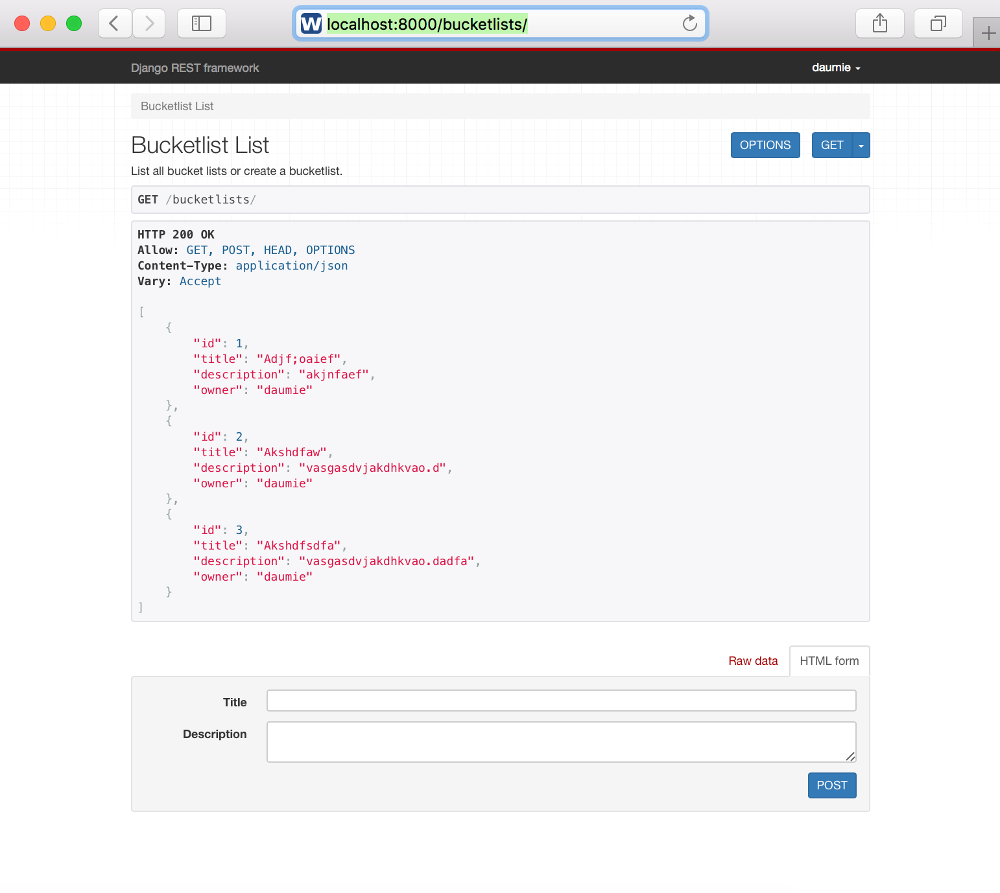
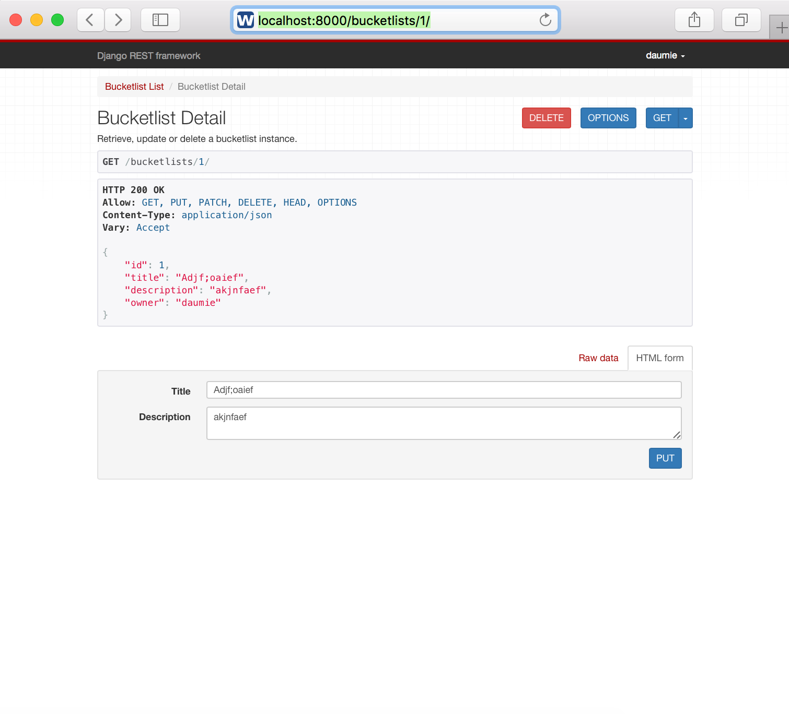
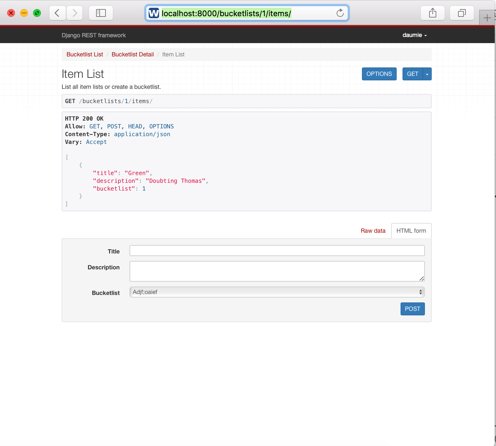
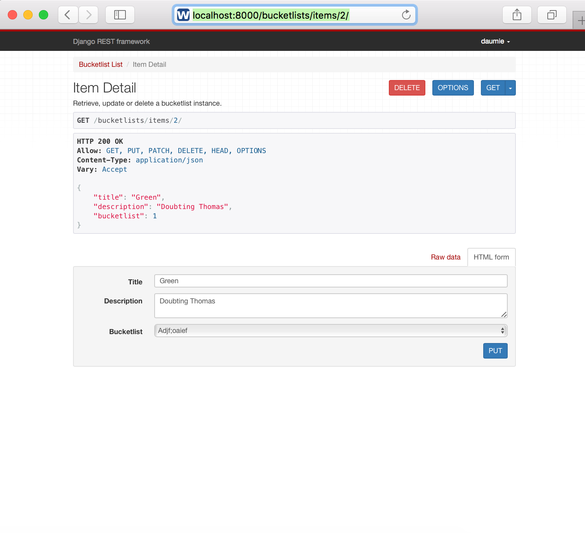

# Bucketlist API and Web_Application

[](https://www.python.org/dev/peps/pep-0008/)
[](https://opensource.org/licenses/MIT)


`"Before the day I die I must visit Canada"`. Alot of people have such phrases. This API creates  the foundaton of an  application that will  help track things you want to do before one dies.

## Bucketlist API

According to Merriam-Webster Dictionary, a Bucket List is a list of things that one has not done before but wants to do before dying.

This is an API for an online Bucket List service using Django-Rest_Framework(DRF)

### Endpoints

Bucketlist Api has the following endpoints

| Endpoint | Functionality |
| -------- | ------------- |
| POST /api-auth/login | Logs a user in |
| POST /bucketlists/ | Create a new bucket list |
| GET /bucketlists/	| List all the created bucket lists |
| GET /bucketlists/<id> | Get single bucket list |
| PUT /bucketlists/<id> | Update this bucket list |
| DELETE /bucketlists/<id> | Delete this single bucket list |
| GET /bucketlists/<id>/items/<item_id> | Get a single bucket list item |
| POST /bucketlists/<id>/items/ | Create a new item in bucket list |
| PUT /bucketlists/<id>/items/<item_id> | Update a bucket list item |

---

### Getting Started

These instructions will get you a copy of the project up and running on your local machine for development and testing purposes. See deployment for notes on how to deploy the project on a live system.

## Prerequisites

Install  [virtualenv](https://virtualenv.pypa.io/en/stable/)
Activate the virtualenv by following this [instructions](http://sourabhbajaj.com/mac-setup/Python/virtualenv.html)
Clone the [bucketlist-django](https://github.com/daumie/bucketlist-django) repo

Install requirements
```pip install -r requirements.txt```

### POST /auth/login Login a User



### POST /bucketlists  Create a bucketlist



### GET /bucketlists/ List created bucketlists


### DELETE /bucketlists/1 Delete bucketlists




### POST /bucketlists/items  Create item in bucketlist 




### GET /bucketlists/<id>/items  List items in bucketlist


### DELETE /api/v1/bucketlists/items  Delete item in bucketlist 2



### GET /bucketlists/items  List items remaining after deletion


### GET /api/v1/bucketlists?limit=20  Test pagination


### GET /api/v1/bucketlists?q=Dance  Search in a bucketlist

